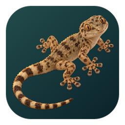

# ActionLay

[](https://github.com/porech/actionlay/releases/latest)
[](https://github.com/porech/actionlay/actions/workflows/ci.yml)
[](LICENSE)



**ActionLay** adds telemetry dashboards to action-camera videos. Display speed,
altitude, maps, heart rate and power; design your own layout and export the result
or a separate overlay for your video editor. Free and open source.

## Download

| System | Download | Install |
|---|---|---|
| macOS 12+, Apple Silicon **and Intel** | [Universal DMG](https://github.com/porech/actionlay/releases/latest/download/actionlay-1.3.0-macos-universal.dmg) | Open the DMG and drag ActionLay to Applications |
| Windows 10/11, 64-bit | [Windows installer](https://github.com/porech/actionlay/releases/latest/download/actionlay-1.3.0-windows-x64-setup.exe) | Choose installation for yourself or everyone; desktop shortcut optional |
| Linux, 64-bit | [Package repositories and setup instructions](https://porech.github.io/actionlay/) | Add the APT or DNF repository, then install `actionlay` |

The **[latest release](https://github.com/porech/actionlay/releases/latest)** also
includes standalone Windows/Linux builds, individual DEB/RPM packages, the
telemetry CLI and checksums. No GitHub account is required.

FFmpeg is included. Linux builds target Ubuntu 22.04 or newer and require ALSA,
VA-API and a graphics backend compatible with wgpu. `SHA256SUMS` is available in each release.

The builds are not signed by an identified publisher or Apple-notarized. On
macOS, if opening is blocked, allow ActionLay in **System Settings → Privacy &
Security**, then open it again. Windows may show SmartScreen's unknown-publisher
prompt; choose **More info → Run anyway** if you want to run the downloaded build.

For upcoming changes, use the **[development release](https://github.com/porech/actionlay/releases/tag/nightly)**,
updated after successful builds of `main`. It may contain unfinished changes.

The Windows installer supports per-user or all-user installation, upgrades,
and uninstall from Windows Apps. Linux packages
are available for APT (Ubuntu/Mint/Debian) and DNF (Fedora-compatible systems).

**Open With** supports `.mp4`, `.mov`, `.lrv` and `.insv` without changing your
default player. On macOS, the bundle declares these formats automatically and
the DMG shows where to drag the app. Windows installers and Linux packages
register them during installation. Portable Windows/Linux copies offer
**Settings → File associations…** for per-user registration and removal;
Windows also offers it at startup, with a **Don't ask again** option.
ActionLay detects installer/package registrations and does not offer a duplicate
registration. Keep portable copies in a permanent location; launching a registered
copy after moving it updates its path. Linux desktop menus may need a new login
if the MIME/desktop database update tools are unavailable.

## What you can do

- **View telemetry while watching footage.** GoPro GPS, speed, altitude,
  acceleration, orientation and more appear in gauges, charts, maps and a G-meter.
  Missing data is shown as unavailable.
- **Use GPX/FIT activities** from a bike computer or watch. Link them to a video,
  align their timestamps and adjust the offset. Supported DJI/Insta360 files can
  also supply native camera telemetry; coverage depends on the camera and firmware.
- **Watch in full screen.** Press F11 to enter; controls and the pointer hide
  after 3 seconds and reappear when you move the mouse. Escape exits. Window
  position, size and maximized state are remembered.
- **Play GoPro chapter sequences** on one timeline without concatenating files.
  Open the first chapter to load the sequence. Opening an intermediate chapter
  offers the choice of loading the whole recording.
- **Build a dashboard visually.** Start from the included Default, Moto, Training
  or imported dashboards. Move, resize and style widgets; select multiple layers,
  snap, group and undo changes. Copy entire sections between layouts, lock the
  selection, or hold Shift while resizing a container to scale its children too.
  Share `.actionlay-layout` packages with assets and fonts, or import layouts from gopro-dashboard-overlay XML.
- **Customize maps.** Choose north-up or direction-up, no route, the completed
  route or the whole route, with separate colours and adjustable line/marker sizes.
  Select providers and offline mode under **Settings → Maps…**.
- **Export video or overlays.** Choose H.264/H.265 MP4, transparent ProRes 4444 MOV,
  PNG sequences, or an overlay on a solid colour for chroma keying.

## Getting started

Open or drag a video into ActionLay. Choose **File → Select Layout…** to switch
dashboards, or open the visual editor to create your own. The editor also works
without a video. Drag a GPX/FIT file onto an open video or use **File → Video
sources…** to link an activity and adjust alignment.

Widgets that need historical telemetry show their own loading indicator and
percentage until the required data is available, including after seeking.
These indicators only appear in the interface. Export completes full-source
metadata preparation before rendering if a widget requires it; widgets that
need only past data recover it as export advances.

Use **Settings → Privacy zones…** to hide private locations and crossing route
segments on maps. Repeated starts and finishes can reveal a home address even
without a “home” label. These zones affect map overlays; they do not redact the
video or coordinates shown by other widgets.

| Shortcut | Action |
|---|---|
| ⌘O / Ctrl+O | Open video |
| ⌘⇧O / Ctrl+Shift+O | Select layout |
| ⌘W / Ctrl+W | Close video |
| Space | Play / pause |
| F11 or double-click the video | Toggle full screen (player only) |
| Esc | Leave full screen |
| → / ← | Next / previous frame |
| O | Show / hide the overlay |

In full screen, move the mouse to show playback controls; they and the pointer hide
after three seconds of inactivity. Full screen is unavailable in the layout editor.
The app remembers the normal window position and size, and whether it was maximized.

The diagnostic line beneath the player is hidden by default. Enable
**Settings → Interface → Show diagnostic data** to see decoder, frame and A/V statistics.

**Settings → Interface** also offers a searchable selector for 34 languages.
**System default** follows the system language; unsupported languages use English.
**Settings → Regional settings** controls measurement units separately. Layouts
and widgets use **Default** to inherit their units; explicit units override this.
Data widgets retain their last valid value during short telemetry gaps, with a
configurable tolerance of three seconds in included layouts. Network buffering
keeps the last displayed telemetry until metadata for the frame is available.
Included layouts show the entire route, centered and fitted to 80% of the map.
The map widget supports fixed zoom or fitting the complete route. While loading,
preview uses fixed zoom; export loads the full route before rendering any frame.

**Settings → Advanced** configures read-ahead, the buffer required before playback,
and memory for compressed packets. Read-ahead starts even while paused; changes
apply immediately. Defaults are 3 seconds ahead, 2 seconds before playback and 32 MiB.

### Export

Choose **Export…** in the toolbar or **File → Export Video…**. Select the mode,
time range and a new destination. The initial mode is **Video with overlay**;
subsequent exports remember your settings. Choose **Balanced**, **High quality**
or **Fast export**. Balanced preserves supported source codec/container,
resolution and bitrate while re-encoding the overlay; **Advanced** exposes
individual encoding controls and a resolution override. Transparent overlays
use ProRes 4444 or PNG; solid overlays let you choose a background colour,
green by default.
Existing destinations are not overwritten. Cancellation keeps completed frames
in a playable partial output.

Export currently processes **one source file with embedded GoPro telemetry**.
Linked activities, native-camera telemetry and joined chapter timelines are not
included yet. Export uses eight-bit SDR decoding. Insta360 playback displays the
raw camera stream, without 360 stitching or reframing.

### Browser build

An initial browser version shares the Rust telemetry, overlay renderer and visual
layout editor. It supports local video playback, GoPro telemetry, browser-backed
MP4 export, layout import/download, and preferences/recent layouts in localStorage.
See [browser build, deployment and current limitations](docs/web.md). The Pages
workflow deploys the latest stable tag under `/web/` alongside the Linux
repositories; commits on `main` test the web app without publishing it.

### Command-line tools

The download includes `actionlay-telemetry` for inspecting telemetry or dumping
CSV/JSON. On macOS, both tools are in `ActionLay.app/Contents/MacOS/`.

```sh
actionlay GX010123.MP4
actionlay-telemetry info GX010123.MP4
actionlay-telemetry dump GX010123.MP4
actionlay export --out ride.mp4 --start 5 --end 20 GX010123.MP4
actionlay export --mode transparent --out overlay.mov GX010123.MP4
```

Use `actionlay-telemetry --help` or `actionlay export --help` for options.

## Building and contributing

See the [developer and contributor guide](docs/building.md) for desktop and web
setup, build commands, architecture, development workflow, tests, diagnostics
and contribution guidance. It explains the shared Rust layers and the native
and browser backends, including how to check changes across both.

For platform coverage and hosting details, see [the browser guide](docs/web.md).
Maintainers can find versioning, installers and deployment instructions in
[the release guide](docs/releasing.md).

## Credits and licence

Inspired by [gopro-dashboard-overlay](https://github.com/time4tea/gopro-dashboard-overlay)
and [Gyroflow](https://github.com/gyroflow/gyroflow). See [all credits](docs/credits.md).
While I was developing ActionLay and thinking about an icon, a wild gecko
entered my office. I took this [photograph](assets/icons/source/IMG_20261006_132445_1.jpg),
and the unexpected visitor became the inspiration for the logo.

ActionLay's code is licensed under [GPL-3.0-or-later](LICENSE). The original gecko
photograph and logo/icon artwork are available under [CC BY-SA 4.0](assets/icons/LICENSE-CC-BY-SA-4.0.txt)
or GPL-3.0-or-later, at your option; see the [artwork licence and attribution](assets/icons/README.md).
The binaries include GPL-enabled FFmpeg,
x264 and x265. Source revisions and build scripts are included in the repository;
licence notices and source links accompany the downloads. Each release also
includes the exact FFmpeg/x264/x265 sources in `third-party-sources-1.3.0.tar.gz`.

## Legal notice

ActionLay is an independent project. It is not affiliated with, endorsed,
sponsored or supported by any of the brands, companies or organizations
mentioned in this repository. All trademarks and product names belong to their
respective owners and are used solely for identification and reference.

ActionLay is not affiliated with, endorsed, sponsored or supported by the gecko,
either. Its visit was unsolicited.
